# Procesverslag
Markdown is een simpele manier om HTML te schrijven.  
Markdown cheat cheet: [Hulp bij het schrijven van Markdown](https://github.com/adam-p/markdown-here/wiki/Markdown-Cheatsheet).

Nb. De standaardstructuur en de spartaanse opmaak van de README.md zijn helemaal prima. Het gaat om de inhoud van je procesverslag. Besteedt de tijd voor pracht en praal aan je website.

Nb. Door *open* toe te voegen aan een *details* element kun je deze standaard open zetten. Fijn om dat steeds voor de relevante stuk(ken) te doen.

## Jij

  
uitwerken voor kick-off werkgroep

  ### Auteur:
  Zoë de Vette

  #### Je startniveau:
  Blauw

  #### Je focus:
  Responsive
 

## Je website

  
uitwerken voor kick-off werkgroep

  ### Je opdracht:
  (https://www.denieuwebibliotheek.nl/)

  #### Screenshot(s) van de eerste pagina (small screen): 
  Homepagina
  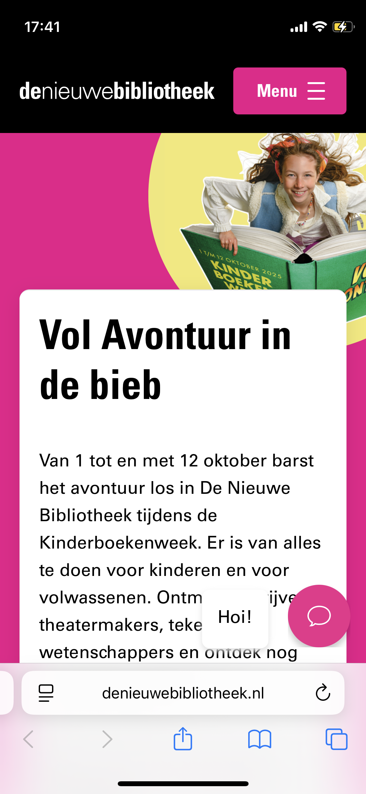

  #### Screenshot(s) van de tweede pagina (small screen):
  Detail pagina 
  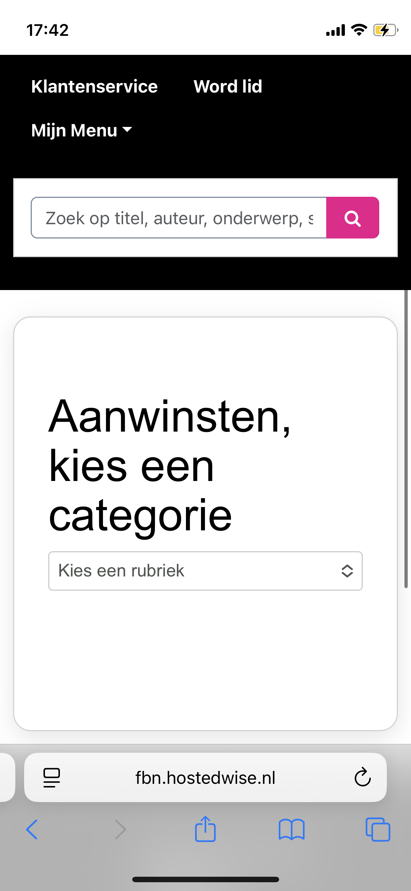
 

## Toegankelijkheidstest 1/2 (week 1)

  
uitwerken na test in 2e werkgroep

  ### Bevindingen
  De structuur van de headings op de echte website zijn niet erg logisch. Je hoort bij meerdere headings 'link' en bij sommige zelfs 'geopend' waarbij ik al niet begrijp wat ie bedoelt want ik heb helemaal geen andere vensters daarvan open staan. 
  De linkjes hebben wel een goeie naam en geven duidelijk aan waar je naartoe gaat. 

  Ik heb via een website de website laten scannen door een accessibility check (hier de link naar de website: https://www.accessibilitychecker.org/audit/?website=https%3A%2F%2Fwww.denieuwebibliotheek.nl%2F&flag=eu)

  En hier wat screenshots bij wat er uit de test kwam (de website scoort erg slecht):
  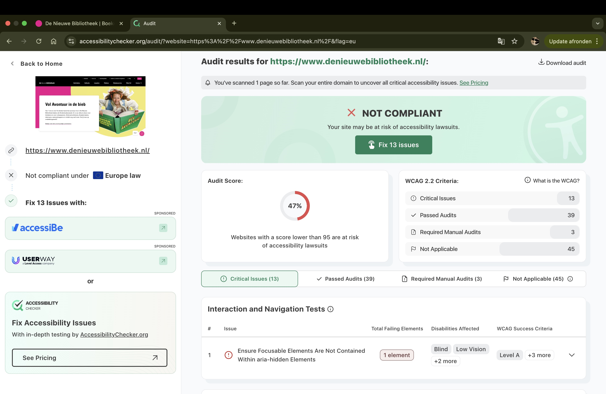

  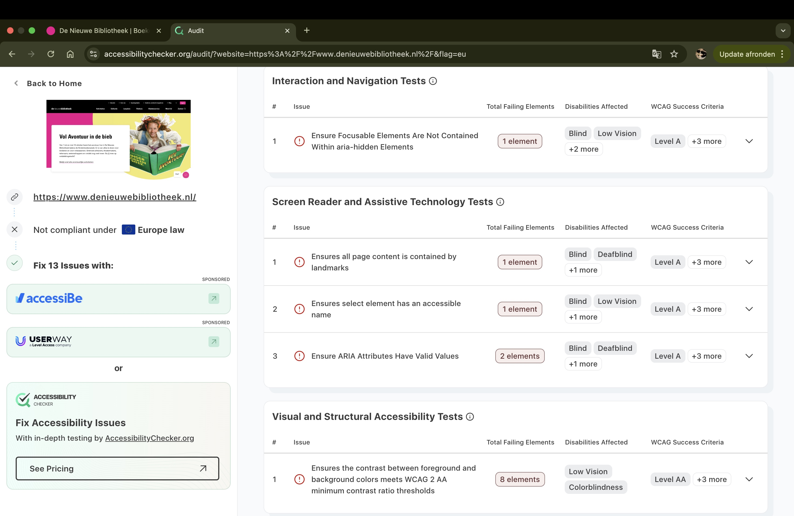

## Breakdownschets (week 1)

  
uitwerken na afloop 3e werkgroep

  ### de hele pagina: 
  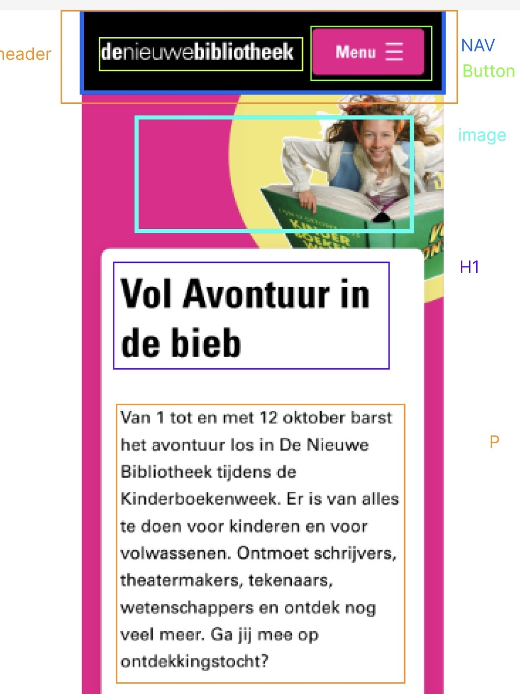
  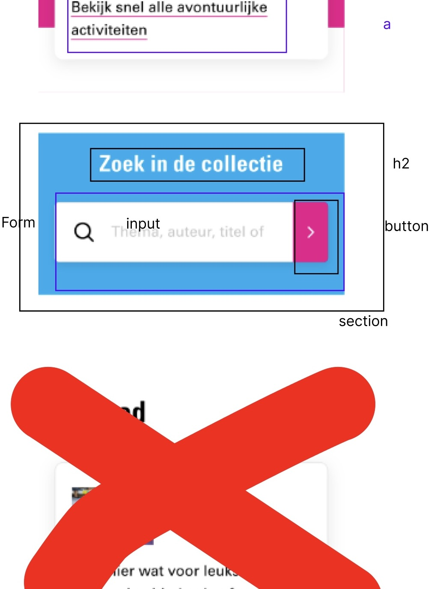
  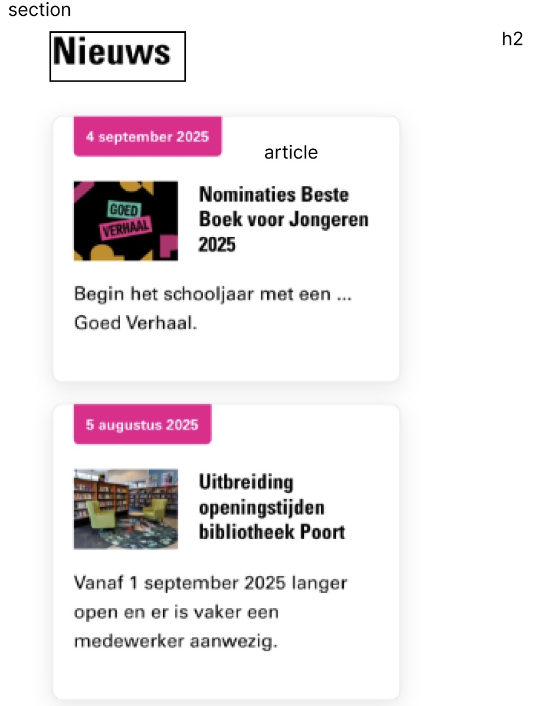
  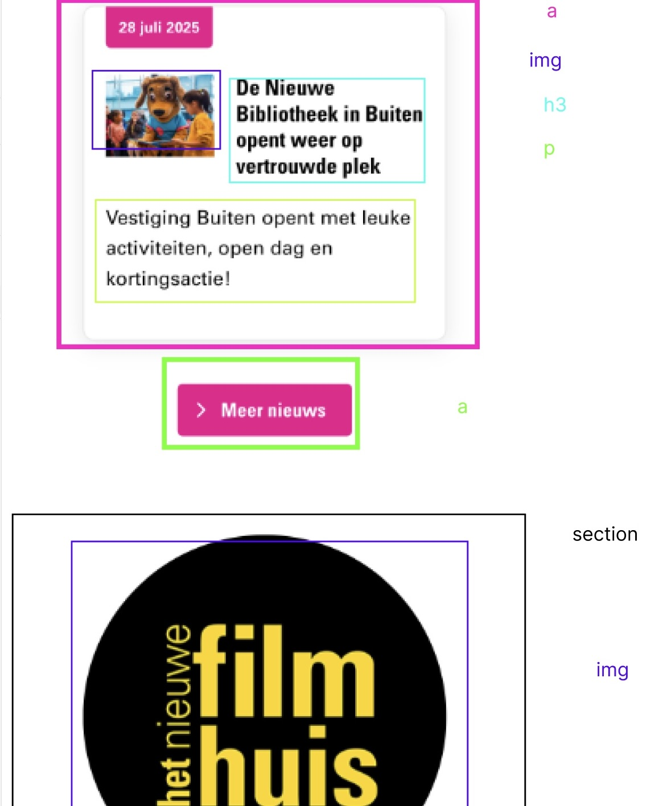
  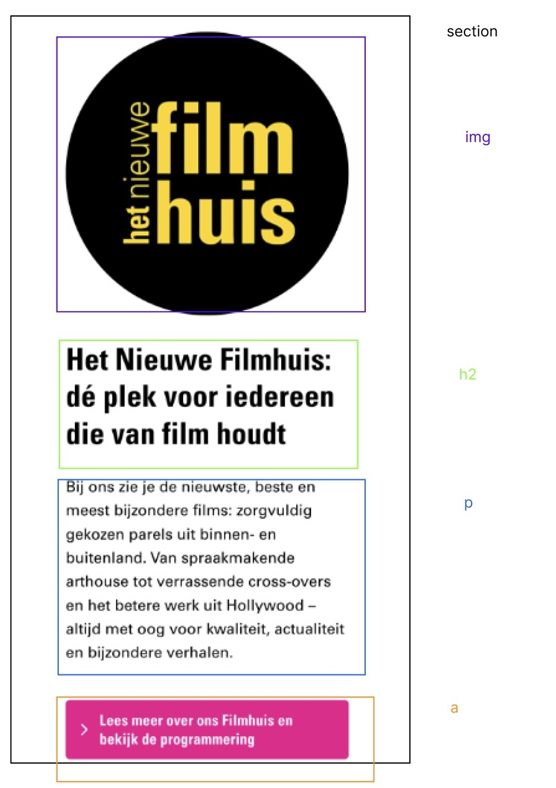
  

  ### detail pagina: 
  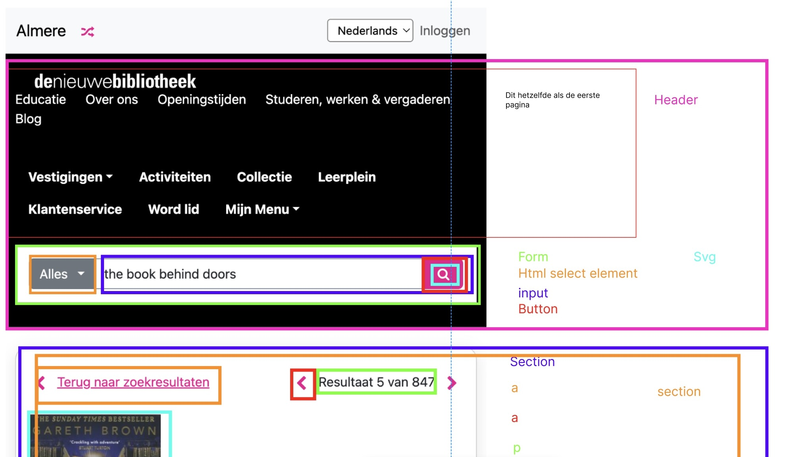
  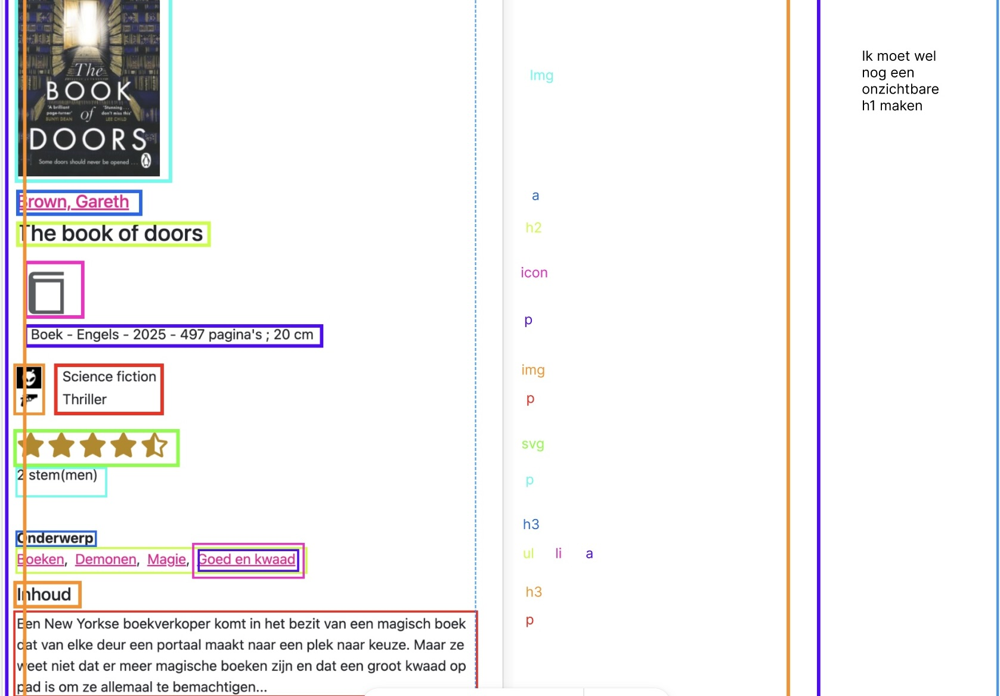
  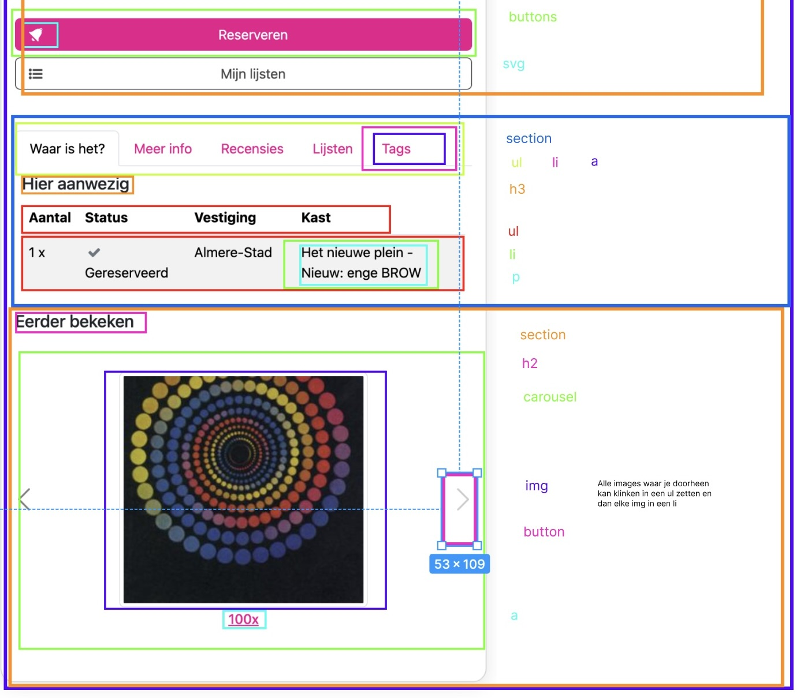
  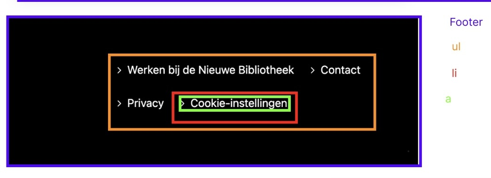

## Voortgang 1 (week 2)

  
uitwerken voor 1e voortgang

  ### Stand van zaken
  hier dit ging goed & dit was lastig (neem ook screenshots op van delen van je website en code)

  ### Agenda voor meeting
  samen met je groepje opstellen

  | Zoë            | Charlie             | Marc         |  Elif             |
  |Breakdown schets| html                | html         | Breakdown schets  |
  |                |                     |              | en                |
  |                |                     |              | html              |
  |                |                     |              | ...               |

  ### Verslag van meeting
  hier na afloop snel de uitkomsten van de meeting vastleggen

  - Snapt hoe een breakdownschets moet.
  - Begrijpt de start van de html

## Voortgang 2 (week 3)

  
uitwerken voor 2e voortgang

  ### Stand van zaken
  Ik ben eindelijk begonnen met het neerzetten van de code en dan vooral de inhoud zoals de tekst etc. Ik had mijn html nog niet echt op orde dus het was moeilijk leesbaar tijdens de vragen die ik stelde aan studentassistenten dus dat heb ik opgelost.

  ### Agenda voor meeting
  samen met je groepje opstellen

  | Elif                                  | David              | Charlie               | Marc                | Zoë
  | HTML laten checken                    | CSS laten checken  | Html laten checken    | Html laten checken  | Html laten checken
  | en dat ook nog                        | en                 | en                    | en                  | en
  | specifieke vraag website (responsive) | html laten checken | Breakdownschets       | CSS laten checken   | Vraag over links
  |                                       |                    |                       |                     |

  ### Verslag van meeting
  hier na afloop snel de uitkomsten van de meeting vastleggen

  - Hashtag geleerd bij linkje
  - scrollen met css geleerd
  - voor responisve gebruik maken van grid in css

## Toegankelijkheidstest 2/2 (week 4)

  
uitwerken na test in 9e werkgroep

  ### Bevindingen
  Ik heb in deze week nog niet mijn eigen website kunnen testen op toegankelijkheid omdat ik nog niet ver genoeg was om iets te kunnen
  testen.

## Voortgang 3 (week 4)

  
uitwerken voor 3e voortgang

  ### Stand van zaken
  Ik had zelf moeite met het het maken van de nav. Daardoor ben ik de laatste les bij een studentassistent gaan zitten en die heeft me laten zien hoe ik dat kon doen en de code daarvan naar me toegestuurd. 

  ### Agenda voor meeting
  samen met je groepje opstellen

  | Zoë                                             | Elif                  | Marc    
  | ---                                             | Had een vraag over    | Had een vraag over z'n nav         
  | Ik had niet echt veel te bespreken omdat ik     | haar tweede pagina    | en over de responsiveness 
  | de dag ervoor al veel vragen had gesteld aan    | en wilde de feedback  | van z'n website 
  | de student assistent en toen had ik nog niet    | op haar html.         |           
  | alles in de code kunnen zetten daarvan voordat  |                       |
  | het voortgangsgesprek was.                      |                       |

  ### Verslag van meeting
  Het was een korte meeting omdat we allemaal nog vollop bezig waren. We waren het er allemaal over eens dat er nog wel wat vragen 
  bij ons op zouden komen in de tijd dat we thuis aan de code verder werken. Verder hebben we het nog gehad over welke mogelijke
  vragen er gesteld zouden kunnen worden tijdens het eindgesprek.

  - Voice-over moeten kunnen gebruiken.
  - Iedereen moest z'n verslag (dit verslag) nog bijwerken.
  - Voor een dark modus hoef je niet de afbeeldingen aan te passen.
  - Comments zetten in de css zodat Sanne tijdens het eindgesprek snel kan zien waar dat specifieke stukje over gaat.

## Eindgesprek (week 5)

  
uitwerken voor eindgesprek

  ### Je uitkomst - karakteristiek screenshots:
  

  ### Dit ging goed/Heb ik geleerd: 
  Korte omschrijving met plaatjes

  

  ### Dit was lastig/Is niet gelukt:
  Korte omschrijving met plaatjes

  

## Bronnenlijst

  
continu bijhouden terwijl je werkt

  Nb. Wees specifiek ('css-tricks' als bron is bijv. niet specifiek genoeg). 
  Nb. ChatGpT en andere AI horen er ook bij.
  Nb. Vermeld de bronnen ook in je code.

  1. https://www.a11yproject.com/posts/how-to-hide-content/
  2. https://www.denieuwebibliotheek.nl/
  3. https://developer.mozilla.org/en-US/docs/Web/CSS/@media/hover

